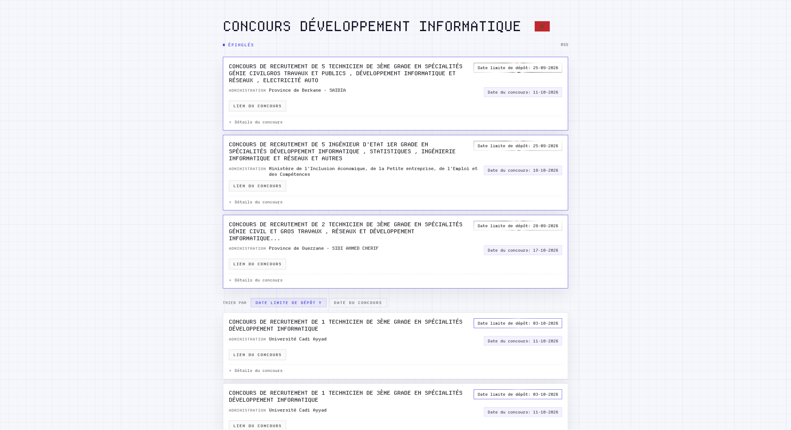

<div align="center">

# Concours Tracker

[](https://workers.cloudflare.com/)
[](https://hono.dev/)
[](https://developers.cloudflare.com/d1/)
[](https://www.typescriptlang.org)
[](LICENSE)

:star: If you find this project helpful, please consider starring it on GitHub!

[Overview](#overview) • [Features](#features) • [Architecture](#architecture) • [Getting Started](#getting-started) • [Email Flows](#email-flows) • [Deployment](#deployment)



</div>

## Overview

**Concours Tracker** watches the Moroccan public-sector recruitment portal (`emploi-public.ma`, indexed via `wadifa-info.com`), keeps only the software and web development roles, and distributes them by email and RSS.

It runs entirely on Cloudflare Workers with D1.

## Features

- **Serverless**: Cloudflare Workers, D1, and Cron Triggers.
- **Hybrid classification**: deterministic French/Arabic rules first, AI (OpenRouter with PDF parsing) for ambiguous listings, with a guardrail that requires cited evidence.
- **Automated scraping**: an every-5-hours cron refreshes listings; expired deadlines are pruned.
- **Double opt-in subscriptions**: an address is only added to the mailing list after the recipient clicks a confirmation link.
- **Scheduled notifications**: digests are sent only during configured local hours.
- **RSS feed** plus a server-rendered web UI.
- **Bot protection**: Cloudflare Turnstile on the subscribe form.

## Architecture

The worker has two entry points: a Hono `fetch` handler (web UI, RSS, and API routes) and a `scheduled` handler (crons).

```
Cron "0 */5 * * *"  ──► scrape ──► classify (rules → AI) ──► merge & prune (D1)
Cron "0 * * * *"    ──► notification pass (only during NOTIFY_HOURS)
                                 │
GET /api/refresh  ───────────────┘
                                 ▼
                       Brevo (prod) / Mailpit (dev)
```

Stack:

- **Hono** — routing and server-rendered JSX (`hono/html`).
- **Cloudflare D1** — SQLite persistence for listings.
- **Cron Triggers** — scheduled scraping and notification passes.
- **Cheerio** — HTML scraping.
- **Zod** — request validation.
- **Brevo** — email delivery and mailing-list storage.
- **OpenRouter** — AI classification.

## Getting Started

### Prerequisites

- [Bun](https://bun.sh/) (runtime, package manager, test runner)
- [Wrangler CLI](https://developers.cloudflare.com/workers/wrangler/install-and-update/)
- Optional: Docker (for Mailpit), plus accounts with [Brevo](https://app.brevo.com/), [OpenRouter](https://openrouter.ai/) and [Cloudflare Turnstile](https://www.cloudflare.com/products/turnstile/)

### Installation

```bash
git clone https://github.com/mouadlotfi/concours-tracker.git
cd concours-tracker
bun install
```

### Configure the local environment

```bash
cp .env.dev.example .env.dev
```

`.env.dev` is gitignored and is loaded by `bun run dev` (`wrangler dev --env-file .env.dev`). Every variable is documented in [`.env.example`](.env.example).

For local email testing, start [Mailpit](https://mailpit.axllent.org/) and read captured mail at <http://127.0.0.1:8025>:

```bash
docker run --rm -p 1025:1025 -p 8025:8025 axllent/mailpit   # Docker
brew install mailpit && mailpit                             # Homebrew
sudo sh < <(curl -sL https://raw.githubusercontent.com/axllent/mailpit/develop/install.sh) && mailpit   # script (Linux & macOS)
```

With `MAILPIT_URL` set, outgoing email goes to Mailpit instead of Brevo.

### Initialize the local database

```bash
bunx wrangler d1 execute concours-db --local --file=schema.sql
```

### Run

```bash
bun run dev          # http://127.0.0.1:8787
```

### Local testing

`CRON_SECRET` is required — `/api/refresh` returns 401 without a matching `secret`.

Exercise the scrape and classification pipeline without writing or emailing:

```bash
curl "http://127.0.0.1:8787/api/refresh?secret=dev-cron-secret&dry_run=true&reclassify=true"
```

Send a test notification to `TEST_EMAIL` (bypasses the notification window):

```bash
curl "http://127.0.0.1:8787/api/refresh?secret=dev-cron-secret&force_email=true"
```

Use `notify=false` to persist refreshed classifications without sending anything.

### Commands

| Command | Purpose |
|---|---|
| `bun run dev` | Local worker, loading `.env.dev` |
| `bun test` | Test suite |
| `bun run lint` | Typecheck (`tsc --noEmit`) |
| `bun run db:seed` | Load `seeds/dev.sql` into local D1 |
| `bun run db:reset` | Delete all local listings |
| `bun run deploy` | Deploy to Cloudflare |

## Email Flows

Three emails are sent:

1. **Confirmation** (`sendConfirmEmail`) — on `POST /api/subscribe`. Contains a signed, 48-hour link to `/confirm`.
2. **Welcome** (`sendWelcomeEmail`) — after the link is confirmed. Only at this point is the address added to the Brevo list.
3. **New listings** (`notifySubscribers`) — one digest per notification slot, nearest deadline first.

Subscription is double opt-in: `POST /api/subscribe` never writes to the mailing list, `POST /api/confirm` does. The subscribe endpoint returns the same response either way, so it cannot be used to probe list membership.

Unsubscribe uses a stateless HMAC link (`/unsubscribe` → `POST /api/unsubscribe`).

### Notification schedule

Listings are collected continuously but emailed only during the local hours listed in `NOTIFY_HOURS`, interpreted in `NOTIFY_TIMEZONE` (defaults `8,18` and `Africa/Casablanca`, set in `wrangler.toml`):

- The hourly cron decides whether to send; the every-5-hours cron scrapes.
- Outside the window, pending listings are held and sent at the next slot.
- A listing is marked notified only after a successful send, so a failed delivery is retried rather than lost.
- A manual `GET /api/refresh` flushes pending listings immediately, outside the window.

## Deployment

1. **Authenticate:**

   ```bash
   bunx wrangler login
   ```

2. **Create the production database** (first deploy only) and copy the generated `database_id` into `wrangler.toml`:

   ```bash
   bunx wrangler d1 create concours-db
   ```

3. **Initialize the schema** (first deploy only).

   > `schema.sql` drops and recreates its tables. Run it only against a new, empty database.

   ```bash
   bunx wrangler d1 execute concours-db --remote --file=schema.sql
   ```

   For a database that already has data, apply the notification-schedule column instead. **The backfill is required**: without it, the first notification pass emails every existing listing at once.

   ```bash
   bunx wrangler d1 execute concours-db --remote --command \
     "ALTER TABLE concours ADD COLUMN notifiedAt DATETIME; UPDATE concours SET notifiedAt = CURRENT_TIMESTAMP WHERE notifiedAt IS NULL;"
   ```

   If the database tracks migrations (`SELECT name FROM d1_migrations` returns rows), use `bunx wrangler d1 migrations apply concours-db --remote` instead.

4. **Set secrets** (see [`.env.example`](.env.example)):

   ```bash
   bunx wrangler secret put SMTP_API_KEY
   bunx wrangler secret put SMTP_SENDER_EMAIL
   bunx wrangler secret put SMTP_LIST_ID
   bunx wrangler secret put UNSUBSCRIBE_SECRET
   bunx wrangler secret put SUBSCRIBE_CONFIRM_SECRET   # optional; falls back to UNSUBSCRIBE_SECRET
   bunx wrangler secret put CRON_SECRET
   bunx wrangler secret put OPENROUTER_API_KEY
   bunx wrangler secret put NEXT_PUBLIC_TURNSTILE_SITE_KEY
   bunx wrangler secret put TURNSTILE_SECRET_KEY
   ```

5. **Deploy:**

   ```bash
   bun run deploy
   ```

## License

This project is licensed under the GNU General Public License v3.0. See the [LICENSE](LICENSE) file for details.
